# Flexible and Energy-Efficient Accelerator for Sparse Convolution Neural Networks

This project is the first-place winner of the undergraduate project competition at NCHU EE. It features a design that modifies the Eyeriss v2 architecture to create a flexible and energy-efficient accelerator for Sparse Convolutional Neural Networks. Significant improvements include modifying the operational mode of Processing Elements (PEs) to use `im2col` and `GEMM`, overhauling the router logic, and introducing a novel data flow that combines weight stationary, input stationary, and output stationary paradigms.

## Current Project Status
### FPGA Design Overview
- **Open Source Design:**  
  This project currently provides an open-source FPGA design. It is important to note that this open-source project only offers the most basic prototype of the architecture. The ASIC design, while conceptually similar, involves some architectural differences and will not be open-sourced. For example:
  - The FPGA design does not support the Network-on-Chip (NoC) systolic array, which is implemented in the ASIC design.
  - The Processing Elements (PEs) in the FPGA design do not support pipelining, unlike in the ASIC design where pipelining is utilized for improved performance.

- **Top Control for LeNet-5:**  
  The current FPGA design includes a top control module tailored specifically for LeNet-5. If you wish to infer other models, you will need to modify the top control module or develop a software layer to drive the hardware.
- **Customization of Array Size:**  
  The source code allows you to modify the array sizes to meet your specific needs. The original code does not include a parameterized option for automatic array size adjustment. However, you can duplicate the existing structure in the code to fit your desired specifications.

### Known Issues and Limitations
- **Compressed Sparse Column (CSC) Implementation:**  
  The CSC implementation supports matrices where the first and last columns contain zeros. However, it does not support cases where two consecutive columns are entirely zeros. To mitigate errors, the last value of the second zero column is filled with a `1`.
- **Batch Normalization:**  
  Batch normalization is not currently supported in the hardware design. If you require batch normalization, you would need to either:
  - Modify the logic in the top control module.
  - Remove the top control module entirely and handle batch normalization in software. Note that you would need to implement the software support yourself.

## TODOs
- **Software Driver Development:**  
  Development of a software driver for better control and flexibility when deploying different models is a future goal.
- **CSC Implementation Fix:**  
  Address the issue in the CSC implementation where it does not support matrices with two consecutive columns of zeros.
- **Parameterization for Array Size:**  
  Implement a feature to allow automatic adjustment of array sizes through parameterization, making it easier to adapt the design to different specifications.

## Project Abstract
Deep Neural Networks (DNN) have proven their exceptional performance in various domains, especially in tasks like image classification and recognition. However, the high computational demands, power consumption, and memory requirements of DNNs underscore the need for specialized hardware accelerators. This project introduces a hardware accelerator architecture based on the Eyeriss v2 framework, specifically tailored for Sparse Convolutional Neural Networks (SCNN). By incorporating the im2col and GEMM data restructuring schemes and a systolic array design, we optimized data flow and enhanced the flexibility of the hardware architecture. Using the OpenROAD tool, we implemented the complete design-to-GDSII process and achieved high-performance inference capabilities on the NanGate 45nm CMOS process.

## Contributions
- **Improved Eyeriss v2 Architecture:** Innovatively improved upon the existing framework to enhance data reuse and reduce power consumption.
- **Optimized Data Flow Design:** Through the integration of CSC compression with the Im2col+GEMM approach, optimized data transmission and storage strategies significantly reduce memory footprint and enhance computational efficiency.
- **Systolic Array Design in NoC:** Introduced a systolic array at the network level, solving traditional design issues with combinational loops, ensuring high efficiency and stability in data transmission.

## System Hierarchy Diagram
                                            

## Implementation
### Top-Level Architecture
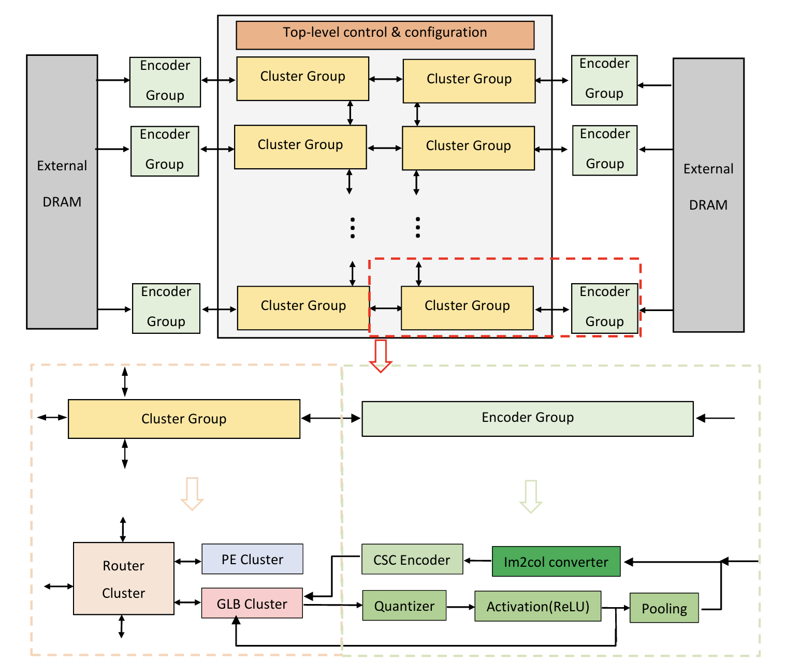
| Component Level | Description | Details |
|-----------------|-------------|---------|
| **Cluster Array** | 8x2 PE Clusters | Adjustable |
|                 | 8x2 GLB Clusters | Adjustable |
|                 | 8x2 Router Clusters | Adjustable |
| **PE Cluster** | 3x3 PEs | Adjustable |
| **GLB Cluster** | 3x(1.77kB) SRAM banks | For iacts |
|                 | 4x1.875Kb SRAM banks | For psums |
| **Router Cluster** | 3 iact routers | - |
|                 | 3 weight routers | - |
|                 | 3 psum routers | Adjustable |

Building upon the original Eyeriss v2 design, our architecture introduces several key enhancements to perfect the operation of the entire hardware accelerator system. As shown in Fig, The core configuration is constructed in an 8x2 cluster array which can be adjusted based on computational needs. Due to resource limitations on FPGA, this configuration is scaled down to a 2x2 cluster array. This flexibility ensures our design can adapt to various neural network configurations.
The encoder group primarily handles data processing. The Im2col converter reconstructs image data into columns, which are then fed into the CSC encoder for direct compression, significantly reducing SRAM usage. After computation, the cluster array reads the partial sums (psums) from the Global Load Balancer (GLB), and they are passed to the quantizer, which reduces the data representation from 21-bit to 8-bit.
Inside the cluster array, we've equipped various components to achieve optimal performance. The computational core, a PE cluster, consists of a 3x3 array of Processing Elements (PEs) responsible for most of the arithmetic operations in the network. The GLB cluster acts as the memory's SRAM Bank, containing 7 independent SRAMs used for storing intermediate activations (iacts) and psums . Finally, the Router cluster is critical for internal data flow, divided into three iact routers, three weight routers, and four psum routers. Furthermore, we've simplified the internal structure of each router compared to the original design, enhancing simplicity and efficiency.

### Global Buffer (GLB) Architecture
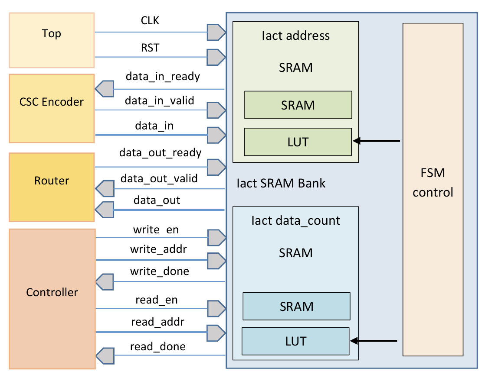
The Global Buffer (GLB) cluster serves as the crucial bridge between the core accelerator and external DRAM. The GLB contains 3 iact SRAMs and 3 psum SRAMs, aligned with the distribution of the PE array within the PE Cluster to provide sufficient bandwidth. The GLB cluster also has dedicated weight ports, which are solely for connecting to the weight routers. Unlike iact and psum SRAM, there are no dedicated SRAMs for storing weights within the GLB; instead, weights are stored directly in the PE’s internal weight SRAM, following a traditional weight stationary data flow.
The SRAM components within the accelerator are synthesized using OpenRAM [6], and all SRAM Banks in the GLB cluster can operate independently, enhancing the system's concurrency and efficiency. Since the iact SRAM stores data compressed via the CSC method, it is divided into two separate SRAMs: one for storing addresses and another for storing data counts.
Due to the variable length of data after CSC compression, which cannot be determined by a standard counter, we have included an additional set of Register Files (RF) within the iact SRAM Banks. These RFs function like a Lookup Table (LUT), tracking the start and end addresses of different groups allocated to the PEs. An internal FSM Controller detects zeros to mark positions in the LUT, with consecutive zeros indicating the end of a compressed data block. The use of '0' marks the end of a data group, providing clear boundaries and aiding in data retrieval. Moreover, to ensure data integrity and communication within the GLB Cluster, we employ a two-way handshake data transmission protocol using 'Valid' and 'Ready' signals to ensure the correctness of data transfers.

### Router Architecture
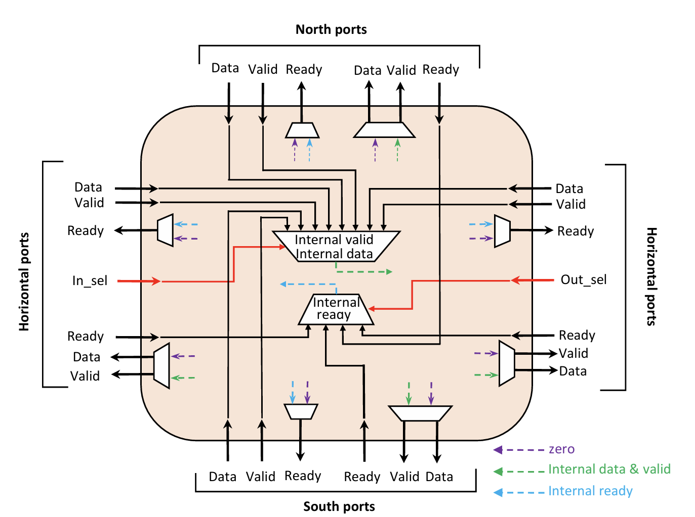
Our router cluster design is heavily inspired by the HM-NoC architecture from Eyeriss v2, but with significant modifications to enhance its functionality. Unlike the original design where data selection occurs at the endpoints with individual MUXes for each output port, our design adopts a more proactive approach. As soon as data arrives at the router, it encounters a MUX that works in conjunction with the `data_in_sel` signal to immediately determine the data destined for transmission. The `routing_mode` (data_out_sel) simply specifies the exit port. This design optimizes data flow by making decisions earlier in the process, reducing redundancy and decision layers, and cutting down MUX usage by 75%.
The router cluster includes 3 iact routers, 3 weight routers, and 3 psum routers. Each router internally utilizes Circuit switching (MUX) for implementation, with systolic registers placed between router connections. Besides the standard handshake protocol, our design incorporates two control signals, `in_sel` and `routing_mode` (out_sel), which direct the flow of data. These operations and logic details are depicted in Fig. Compared to the original Eyeriss v2 router, our design introduces `data_in_sel` to complete a 3-way handshake, further enhancing the router’s capability to control data flow.

### PE Architecture
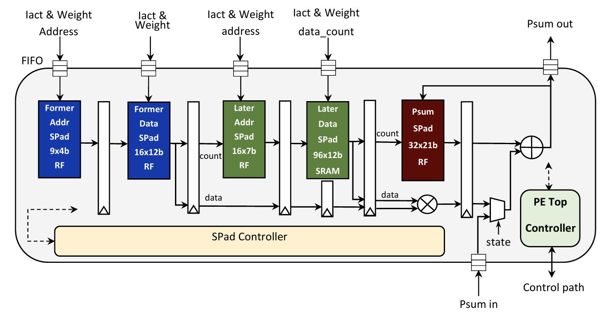
Each Processing Element (PE) in our design includes five Scratch Pads (SPads) for data storage as depicted in Fig. The weights SPad utilizes SRAM for data storage, while the other SPads use a register file (RF). To process data in CSC compressed format during decoding, the Iact address is first used to determine which location in the Iact data SPad to read. The corresponding weight address is then selected through the iact count, and once the iact and weight data are read, their counts determine where the psum should be written. This architecture supports GEMM operations and allows the same iact to be continuously reused across the corresponding row of weights (internal reuse within a PE, and weights reuse among PEs).
Our accelerator employs the same three-vector CSC compression format as Eyeriss v2. However, a significant simplification is made where rows with an entire line of zeros in the address vector use the maximum value of the address to represent this, as shown in Fig. This not only reduces overall complexity but also eliminates the need for an additional subtractor for control. This design treats the internal workings of each PE as a black box, enhancing flexibility and ease of control at the top level. Additionally, we've modified the count format to directly set the count to the current row number, allowing for direct decoding during read operations without extra logic to compute and store the accumulation of leading zeros.
Each PE also features a FIFO at its I/O to buffer data transfers between the PE and external sources (vertically from other PEs or the GLB), ensuring data synchronization and integrity. Every PE operates with an independent state machine, which is one of the most complex parts of our system. It contains seven states to decode the CSC format and match iact with weight positions to complete GEMM operations. The results are then added to the psum in the SPad (completing a MAC operation) before being stored back in the SPad or sent externally for further accumulation.
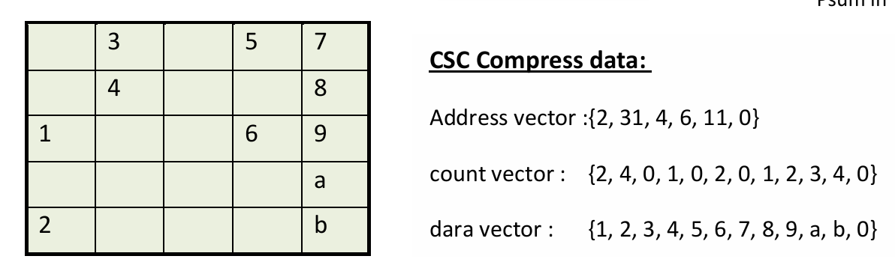

### PE Cluster Architecture
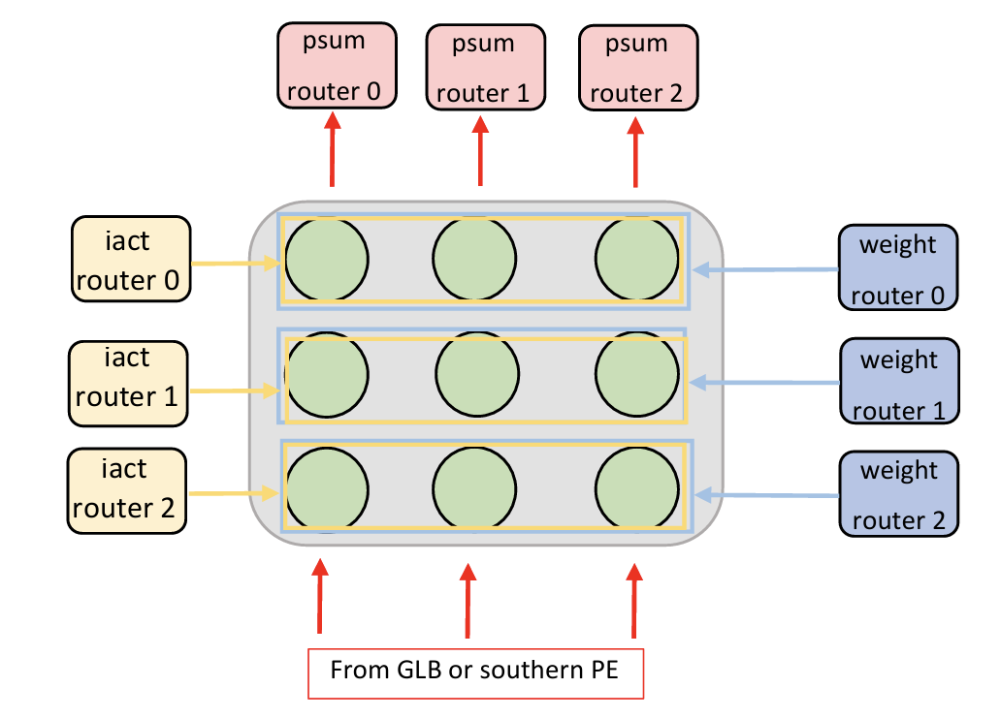
The PE cluster in our design includes a total of 9 Processing Elements (PEs) arranged in a 3x3 grid. This arrangement has been adapted to integrate the im2col data restructuring model. Each row of PEs is connected to one of the three weight routers (enabling horizontal weight reuse) and each column of PEs is connected to one of the three iact routers.
Initially, the iact router sequentially inputs data into the PE Cluster, dividing it into three groups corresponding to different rows of PEs. This structure allows each row of PEs to handle the convolution of separate channels independently. Once all calculations in the PE cluster are completed, the MUX within each PE is set to an external `Psum_in` accumulation mode. The psums within each PE are accumulated vertically, and the accumulated psums from the first row of three PEs are then output through the psum router to the GLB, where they are added or merged with other clusters. Fig. illustrates the entire connection scheme between the PE Cluster and the routers; blue boxes indicate data being simultaneously transmitted to all PEs within the box, and yellow boxes show data being sequentially and specifically transmitted to all PEs within the box.
This data flow varies depending on the type of operation and also affects the type of data reuse. For instance, during convolution layers, the data flow between PEs is weight stationary, and within each PE, it is input stationary, achieving a similar RS+ data flow. This setup allows all types of data to have reuse capabilities. During fully connected layers, the positions of iact and weight inputs into the PEs are swapped, making the data flow between PEs input stationary, while psums are always accumulated vertically.

### Data Flow and Mapping
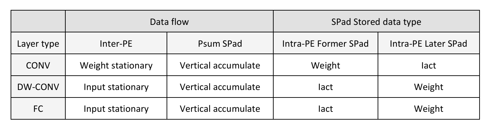
#### 1 Im2Col + GEMM
Upon data ingestion into the accelerator, the im2col transformation is implemented. A converter rearranges the shape of input feature maps (ifmaps) according to the shape and stride of the filter into a new matrix. Although this method requires significant storage space and bandwidth, it flexibly supports filters of various shapes. Before storing the ifmap in the Global Buffer (GLB), the data is compressed using CSC to reduce storage space. This effectively addresses the primary drawback of im2col. Moreover, leveraging the characteristics of massive shared elements on the diagonal of the transformed matrix, the original ifmap elements are decoded by position into all positions of the matrix shape before being stored in the GLB, followed by subsequent GEMM computations distributed via NoC.
#### 2 Data Flow Design and NN Shape Partitioning
During computations, input feature maps (iacts) and filters (weights) are partitioned to fully utilize hardware features for parallel processing and efficient data reuse. With the introduction of the im2col data restructuring model, modifications to the original Row stationary plus data flow are necessary. As indicated in Table 1, since the shape of data post-im2col transformation fits the ordinary matrix multiplication operations, parallel partitioning of data within the PE Cluster becomes relatively straightforward. Each row of the PE array processes a single channel's computations, sharing the same set of weights horizontally (weight stationary), and due to pre-fetching of iacts, the same iact can be reused across the entire row of the weight matrix (input stationary). Each row of PEs processing single-channel data allows for vertical accumulation of psums (across multiple PE Clusters).
In fully connected layers (FC) and depth-wise convolution layers (DW-CONV), the entry points of data into the PE Cluster are swapped, with each row of the PE array using the same set of iacts (input stationary). Each row processes only one channel, and during FC operations, since iacts are fully connected through flattening, the flattened data is divided into groups representing channels, with psums also being vertically accumulated. However, due to the nature of fully connected operations, weights are used only once in the PE, so there is only one row of weights, whereas in DW-CONV, there can be multiple rows. The energy consumption of different levels of data retrieval (DRAM > Global Buffer > PE > RF) suggests that a hierarchical data storage mode coupled with data reuse can significantly reduce the energy cost associated with data retrieval.

### Data Scheduling and Pipeline Design
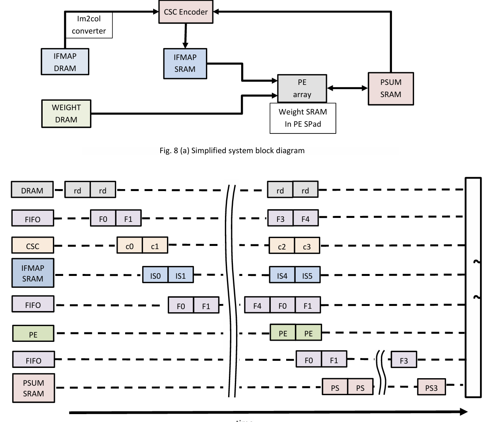
In our hardware architecture design, we have incorporated an on-chip CSC Encoder and an im2col converter. These additions necessitate additional cycles for compressing and restructuring data during operation. Therefore, in the design of our data path, it is essential to implement a pipelined design between different modules to minimize the time spent on loading and compressing data. Fig. illustrates the system's data scheduling and a simplified block diagram of the system.
This design ensures that data flow between components is smooth and efficient, enhancing overall performance by reducing idle times and optimizing the use of available computational resources.

### FPGA Verification
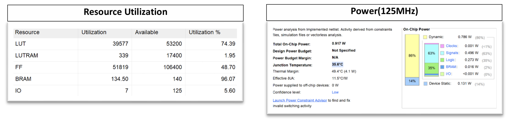
We have implemented and verified our accelerator on an FPGA platform (2x2 Cluster Groups) using the PYNQ-Z2 board. The implementation process involved synthesizing the Verilog code into a bitstream with Vivado and then programming it onto the PYNQ-Z2. For data transmission, we used the board’s PL-side external GPIOs to directly receive data from a PC.
Additionally, we designed a UART protocol interface on the platform, allowing the PL side to directly receive data sent from the PC. The model demonstrated on the FPGA is LeNet-5, which is utilized for handwritten digit recognition. On the PC side, we developed a GUI panel in Python that allows users to input handwritten digits. After completing the input, the data is directly transmitted to the FPGA for inference, enhancing the overall interactivity and authenticity of the operational demonstration.

### LeNet-5 demo (handwritten digit recognition)
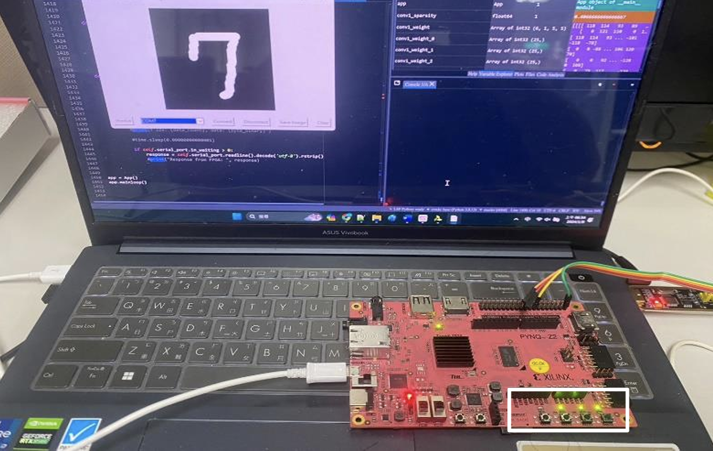

## Experimental Results
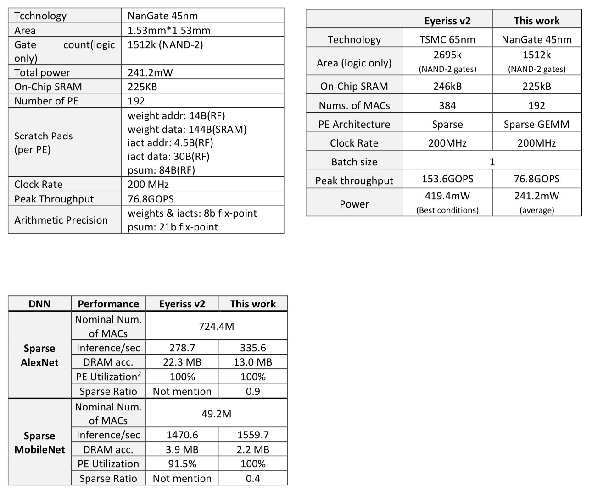
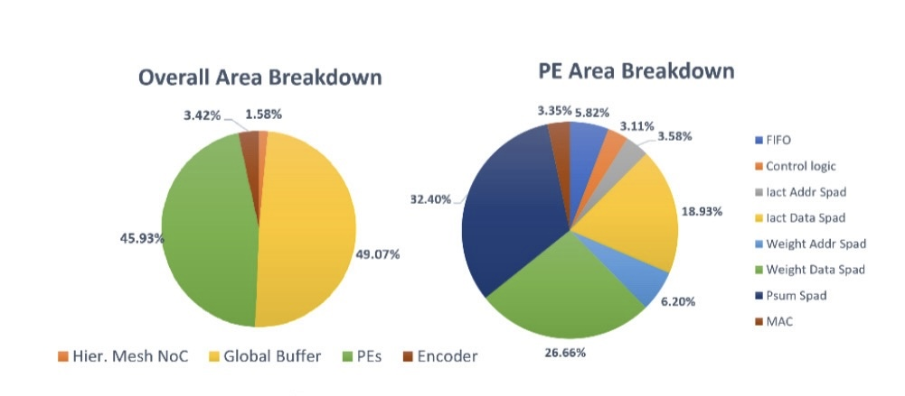
Implemented the ASIC design on a 45nm CMOS technology and validated on FPGA platforms. The hardware accelerator demonstrated outstanding computational speed and energy efficiency, particularly notable when running the MobileNet model, achieving 1559.7 inferences per second.

## Conclusion
This project successfully implemented a highly efficient and flexible hardware accelerator suitable for sparse convolutional neural networks. Future work will explore broader applications of deep learning models and further optimize the accelerator design to accommodate varying computational demands.

## References
- Chen, Y.-H., Emer, J., & Sze, V. (2019). Eyeriss v2: A Flexible Accelerator for Emerging Deep Neural Networks on Mobile Devices. IEEE Journal on Emerging and Selected Topics in Circuits and Systems, 9(2), 292-308.
- Additional references can be found in the references section of this report.

## Repository Contents

- **Verilog Code**: Circuit design files used for both FPGA and ASIC implementations.
- **Python Code**: Scripts for generating test data.
- **Bitstream Files**: Compiled files for FPGA deployment.
- **Research Paper and Reports**: Comprehensive documentation detailing the research, design, and outcomes of the project.
- **Demo Video Link**: [Watch the project demo here](https://www.youtube.com/watch?v=wLz8Di9vdas&ab_channel=BOCHUNChen)
